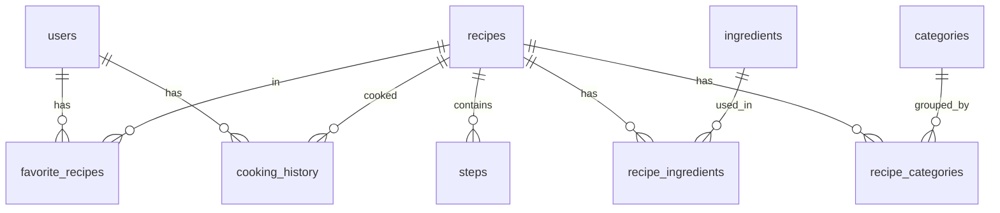

# WhatToEat Backend — Plan (без API-эндпоинтов)

## Модель данных (из schema.xml)

9 таблиц, организованных вокруг рецептов:



**Замечания к схеме (исправим при реализации):**

- В `recipe_ingredients` отсутствует колонка `ingredient_id` FK -- добавим
- В `cooking_history` опечатка `recept_id` -- исправим на `recipe_id`
- В `recipe_categories` колонка `amount` выглядит как артефакт копирования -- уберем
- Тип `srtring` для `servings` -- исправим на `string`/`VARCHAR`

## Структура проекта

```
backend/
  app/
    __init__.py
    main.py                      # FastAPI app, lifespan, middleware
    config.py                    # Pydantic Settings (env-based)
    database.py                  # async engine, session factory
    exceptions.py                # RFC 7807 error handling
    pagination.py                # PaginatedResponse, PaginationParams
    mixins.py                    # UUIDMixin, TimestampMixin, SoftDeleteMixin
    dependencies.py              # get_db_session, get_current_user
    modules/
      auth/
        service.py               # Telegram auth + JWT logic
        schemas.py               # TelegramAuthData, TokenPair, TokenPayload
        utils.py                 # create_access_token, create_refresh_token, verify
      users/
        models.py, schemas.py, service.py
      recipes/
        models.py, schemas.py, service.py
      ingredients/
        models.py, schemas.py, service.py
      categories/
        models.py, schemas.py, service.py
      steps/
        models.py, schemas.py, service.py
      favorites/
        models.py, schemas.py, service.py
      cooking_history/
        models.py, schemas.py, service.py
  alembic/
    env.py
    versions/
  alembic.ini
  pyproject.toml                 # dependencies, ruff config, mypy config
  .env.example
  README.md
  Dockerfile
  docker-compose.yml             # postgres + redis + app
```

## Стек (по BACKEND_RULES.md)

- Python 3.11+, FastAPI, SQLAlchemy 2.0 (async), PostgreSQL 16, Redis 7
- Alembic (миграции), JWT (access + refresh), bcrypt, Pydantic v2
- structlog (JSON), ruff + mypy

## Порядок реализации

### Фаза 0: Инициализация проекта

- `pyproject.toml` с зависимостями и конфигурацией ruff/mypy
- `docker-compose.yml` (PostgreSQL 16, Redis 7)
- `.env.example` и `config.py` (Pydantic Settings)
- `database.py` -- async engine и session factory
- `main.py` -- FastAPI app с lifespan (подключение к БД и Redis при старте)
- `mixins.py` -- UUIDMixin, TimestampMixin, SoftDeleteMixin, VersionMixin
- `exceptions.py` -- RFC 7807 error handler + кастомные исключения
- `pagination.py` -- PaginatedResponse[T], PaginationParams
- `dependencies.py` -- get_db_session, get_current_user, get_pagination
- Alembic init с async поддержкой

### Фаза 1: Модели (все таблицы)

Все модели наследуют UUIDMixin + TimestampMixin. Связи через relationship().

- `users/models.py` -- User (tg_id int64 unique, tg_username, username, phone_number, first_name, last_name)
- `recipes/models.py` -- Recipe (title, photo_url, description, protein, fat, carbs, prep_time, cook_time, difficulty ENUM, servings)
- `ingredients/models.py` -- Ingredient (title unique, unit_of_measurement ENUM)
- `ingredients/models.py` -- RecipeIngredient (recipe_id FK, ingredient_id FK, amount DECIMAL)
- `categories/models.py` -- Category (title unique)
- `categories/models.py` -- RecipeCategory (recipe_id FK, category_id FK)
- `steps/models.py` -- Step (recipe_id FK, step_number INT, title, description TEXT, photo_url nullable)
- `favorites/models.py` -- FavoriteRecipe (user_id FK, recipe_id FK, unique constraint на пару)
- `cooking_history/models.py` -- CookingHistory (user_id FK, recipe_id FK, cooked_at TIMESTAMP)
- Начальная миграция Alembic

### Фаза 2: Auth (ядро, без роутеров)

- `auth/utils.py` -- create_access_token, create_refresh_token, decode_token, verify_telegram_hash
- `auth/schemas.py` -- TelegramAuthData, TokenPair, TokenPayload, RefreshRequest
- `auth/service.py` -- AuthService: authenticate_telegram(), refresh_tokens(), logout()
- Обновить `dependencies.py` -- get_current_user через JWT decode

### Фаза 3: Pydantic-схемы (Create / Update / Response)

Все Response-схемы с `ConfigDict(from_attributes=True)`. Update-схемы -- все поля Optional.

- `users/schemas.py` -- UserResponse, UserUpdate
- `recipes/schemas.py` -- RecipeCreate, RecipeUpdate, RecipeResponse, RecipeListResponse (краткий)
- `ingredients/schemas.py` -- IngredientCreate, IngredientUpdate, IngredientResponse; RecipeIngredientCreate, RecipeIngredientResponse
- `categories/schemas.py` -- CategoryCreate, CategoryUpdate, CategoryResponse
- `steps/schemas.py` -- StepCreate, StepUpdate, StepResponse
- `favorites/schemas.py` -- FavoriteRecipeResponse
- `cooking_history/schemas.py` -- CookingHistoryCreate, CookingHistoryResponse

### Фаза 4: Сервисы (бизнес-логика)

Каждый сервис принимает AsyncSession, содержит CRUD + бизнес-логику.

- `users/service.py` -- UserService: get_by_id, get_by_tg_id, update
- `recipes/service.py` -- RecipeService: create (с ингредиентами + категориями), get_by_id (eager load), list (пагинация + фильтры), update, soft_delete
- `ingredients/service.py` -- IngredientService: create, list, update, delete
- `categories/service.py` -- CategoryService: create, list, update, delete
- `steps/service.py` -- StepService: create, list_by_recipe, update, delete, reorder
- `favorites/service.py` -- FavoriteService: add, remove, list_by_user, is_favorite
- `cooking_history/service.py` -- CookingHistoryService: record, list_by_user

### Фаза 5: Финализация

- README.md с инструкциями по запуску (docker-compose up)
- Dockerfile (multi-stage build)
- Проверка что все модули имеют `__init__.py`
- Проверка импортов и структуры

